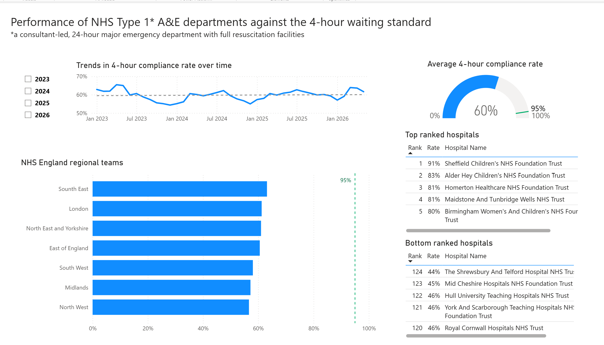
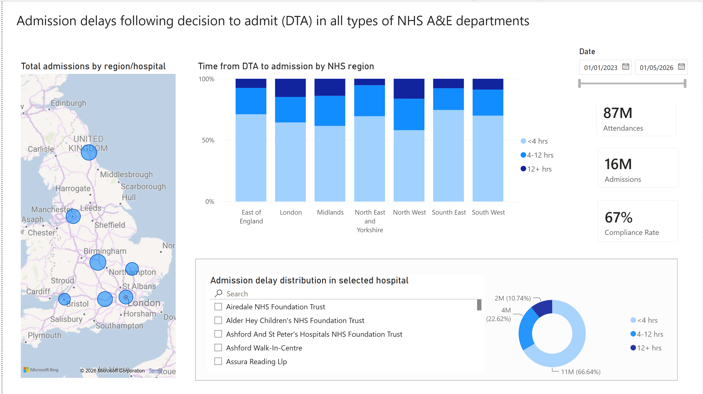

# nhs-ae-performance-dashboard
# NHS England A&E Performance Analytics Dashboard

An end-to-end healthcare analytics project built in **Power BI**, using publicly available NHS England Accident & Emergency (A&E) operational data.

The dashboard integrates 41 monthly NHS datasets with organisational mapping data to monitor emergency care performance, benchmark NHS trusts, identify operational bottlenecks, and analyse regional variation in service delivery across England.

---

## Project Objective

The goal of this project was to build an operational intelligence dashboard that enables monitoring of emergency care performance across NHS trusts and regions.

The dashboard helps answer questions such as:
- Which NHS trusts demonstrate the highest and lowest compliance with the 4-hour waiting target?
- Which regions experience the greatest operational pressure?
- How do admission delays following a decision to admit (DTA) affect overall system performance?
- How do key operational indicators evolve over time?

---

## Dataset

**Source:** [NHS England public statistical datasets](https://www.england.nhs.uk/statistics/statistical-work-areas/ae-waiting-times-and-activity/)

**Data used:**
- 41 monthly A&E operational datasets (multiple Excel files)
- NHS organisational mapping dataset linking trusts to NHS regions

**Period covered:** January 2023 - May 2026

---

## Technical Work Performed

### Data Engineering
- Imported and consolidated 41 monthly Excel files
- Appended monthly datasets into unified fact table
- Cleaned and transformed raw data using Power Query
  
### Data Modelling
- Built a snowflake schema data model
- Created a date dimension and organisational (trust/region) dimension tables
- Built relationships between fact and dimension tables to support cross-filtering

### DAX Calculations
- 4-hour compliance rate KPI
- Breach rate calculation
- Hospital performance ranking using `RANKX()`
- Shortened region name column using `SWITCH()` for cleaner axis/legend labels
---

## Dashboard Overview

The report consists of two pages:

### 1. Performance Against the 4-Hour Waiting Standard
Tracks NHS Type 1 A&E departments (consultant-led, 24-hour major emergency departments with full resuscitation facilities) against the 4-hour waiting standard.

- **Average national 4-hour compliance rate:** 60% (against a 95% national standard)
- Monthly compliance trend from January 2023 to May 2026, with a reference line marking the overall average
- Regional breakdown by NHS England region (South East, London, North East and Yorkshire, East of England, South West, Midlands, North West)
- Top 5 and Bottom 5 performing trusts, ranked by compliance rate
- Year filter (2023-2026)

### 2. Admission Delays Following Decision to Admit (DTA)
Analyses delays between the decision to admit a patient and actual admission, across all types of NHS A&E departments.

- **2M** total A&E attendances in May 2026
- **402K** total A&E admissions in May 2026
- **68%** compliance rate (admissions within 4 hours of DTA)
- Geographic map of total admissions by region/hospital
- Time from DTA to admission by NHS region, segmented into <4 hrs, 4-12 hrs, and 12+ hrs
- Searchable hospital-level drill-through showing admission delay distribution for a selected trust
- Date range slicer (01/01/2023 - 01/05/2026)

---

## Dashboard Features

- National and regional KPI monitoring
- Interactive regional performance map
- Top 5 / Bottom 5 trust benchmarking tables
- Monthly and yearly trend analysis
- Dynamic slicers, cross-filtering, and search
- Drill-through navigation between operational metrics

---

## Key Insights

- National 4-hour compliance (60%) remains well below the NHS constitutional standard of 95%, a gap consistent throughout the 2023-2026 period.
- Performance varies notably by region, with the South East and London outperforming the North West and Midlands.
- Specialist children's hospitals (e.g. Sheffield Children's, Alder Hey Children's) rank among the top performers, while several district general trusts fall well below the national average.
- One in three patients who were admitted following a DTA decision waited longer than 4 hours to be admitted, with a meaningful share waiting over 12 hours - highlighting bed and flow pressures downstream of A&E.

---

## Screenshots

**Page 1 - 4-Hour Waiting Standard Performance**

**Page 2 - Admission Delays (DTA)**

---

## Tools & Skills

- **Power BI Desktop** - data modelling, DAX, report design
- **Power Query (M)** - data cleaning and transformation
- **DAX** - KPI and ranking calculations
- **Data modelling** - snowflake schema, star-schema principles

---

## Limitations & Notes

- All data used is publicly available NHS England A&E statistics; no patient-level or confidential data is included.
- This project is intended for portfolio and skills-demonstration purposes and does not represent an official NHS report.
- Figures are aggregated at trust/regional level and reflect the data as published by NHS England at the time of extraction.

---

## Author

Built by **Anna Shumitckaia** as a portfolio project to demonstrate end-to-end Power BI development: data engineering, data modelling, DAX, and dashboard design.

[LinkedIn](https://www.linkedin.com/in/anna-shumitckaia-24575623a/)
